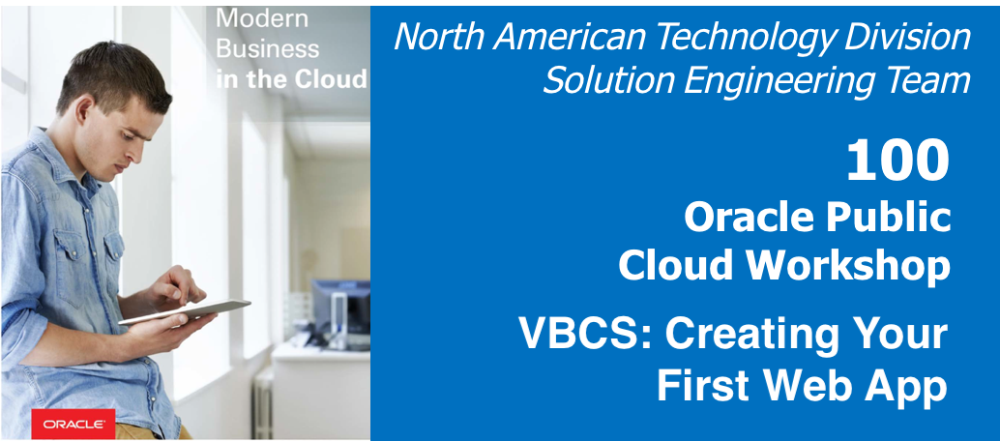  
Updated: November 6, 2018

## Introduction

This is the first of several labs that will show how to integrate different kinds of databases with VBCS. It will lead you through customizing your Web App, creating different kinds of databases, and finally, connecting them with your web page.

This lab will start with creating your first Web App in VBCS. 

**_To log issues_**, click here to go to the [github oracle](https://github.com/oracle/learning-library/issues/new) repository issue submission form.

## Objectives
- Create VBCS Instance 
- Create Web App
    - Add some design elements
    - Add navigation

## Required Artifacts
- The following lab requires an Oracle Public Cloud account; you can sign up for a trial account [here](https://cloud.oracle.com/tryit). 

# Lab 100

## VBCS: Creating Your First Web App

### **STEP 1**: Getting Started

<b>Sign in to your Cloud Account</b>

Go to the [Cloud sign in page](https://cloud.oracle.com/en_US/sign-in).

Sign in to your Cloud Account. <br>
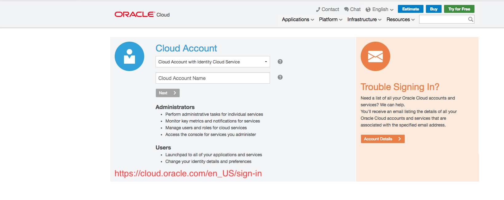 <br>
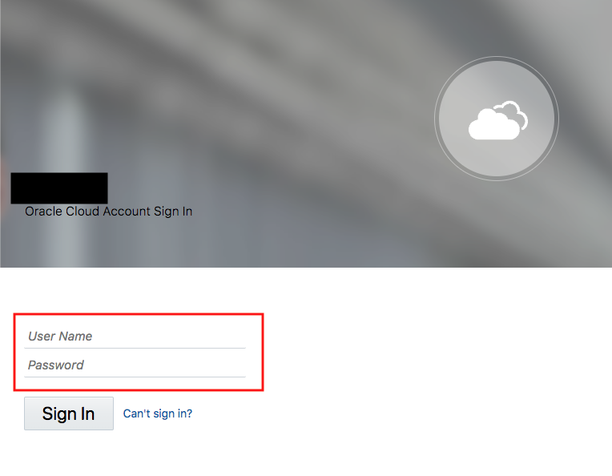 <br>

Navigate to `Cloud Dashboard`, then open the Autonomous Visual Builder Service Console. If Autonomous Visual Builder is not visible, click `Customize Dashboard`, then scroll to Autonomous Visual Builder in the list and hit `Show`.<br>

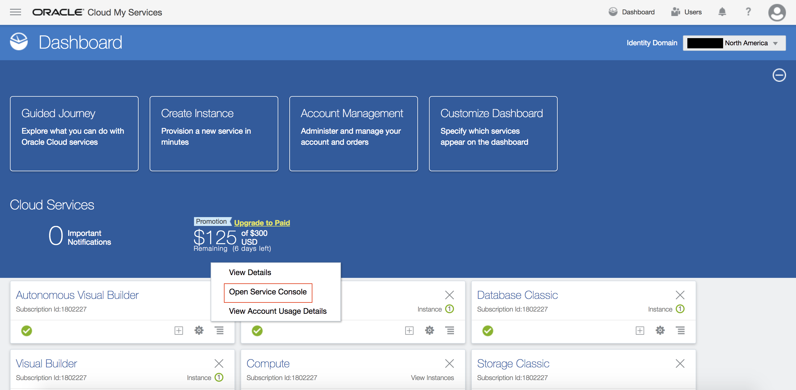 <br>

<b>Create Visual Builder Instance</b>

At the top right of the page, hit `Create Instance`, which will create the underlying infrastructure for VBCS.<br>

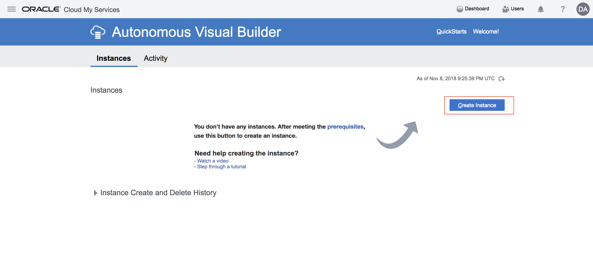<br>

Enter an instance name, and leave the region as the default value `us-ashburn-1`. Click `Next`.<br>

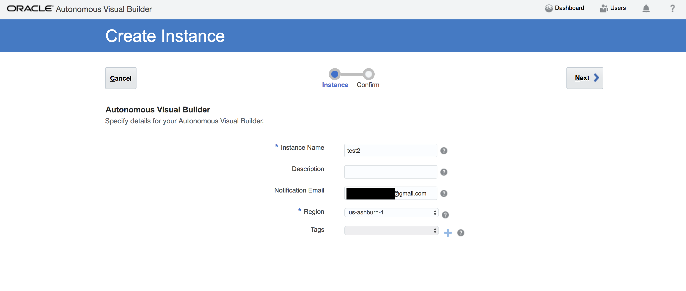<br>

Verify that everything is correct, then click `Create`.<br>

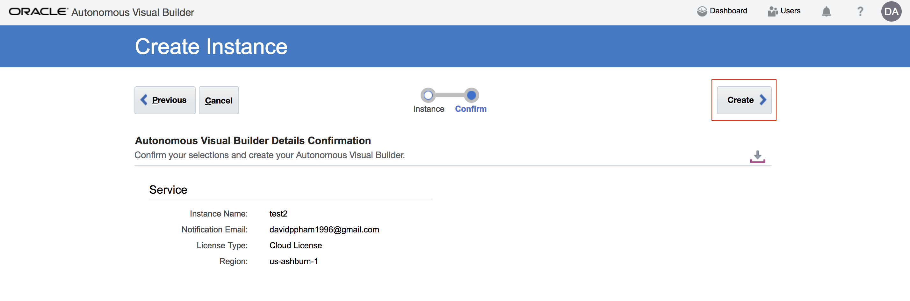<br>

The instance is now being provisioned. This will take a couple of minutes.<br>

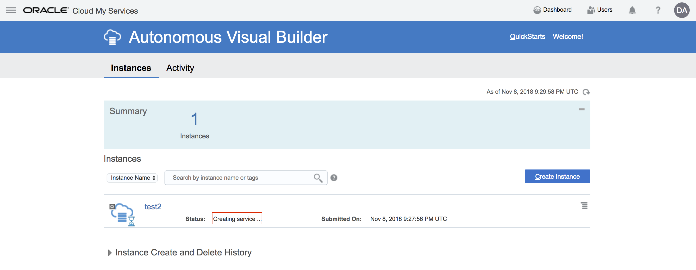<br>

Once the instance has been provisioned, click `Open Visual Builder Home Page`.<br>

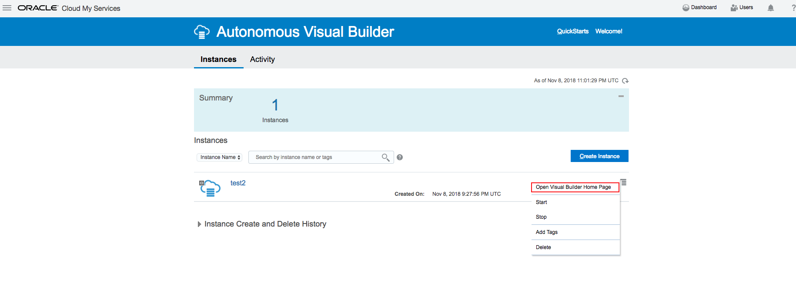<br>

Now, we need to create a Visual Application. A single Visual Application can hold many mobile and web apps. From the home page, hit `New Application`.<br>

<br>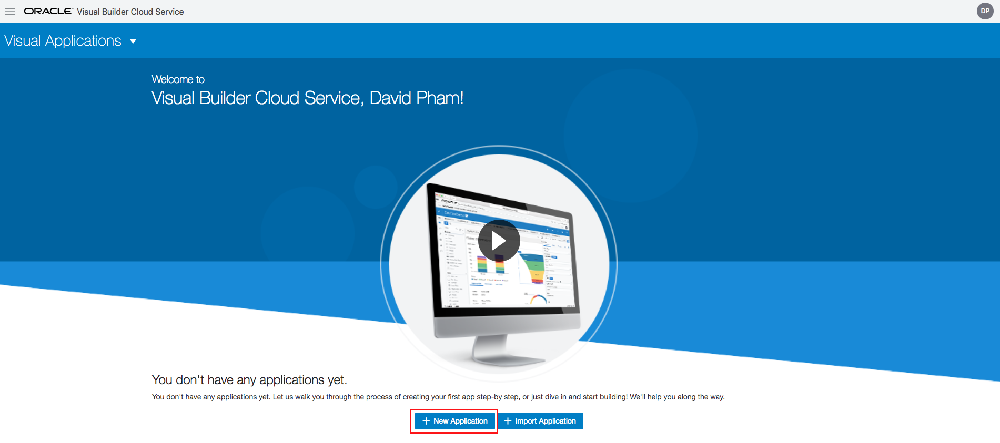<br>

Name the application whatever you like; the `Description` field is optional.<br>

<br>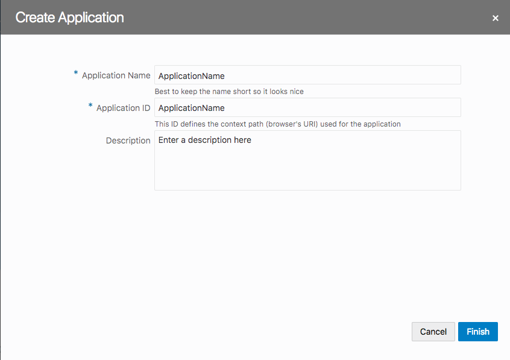<br>

Your new Application should open automatically. 

### **STEP 2**: Creating a Web App

<b>Customize Web App</b>

On the left, hit the computer icon for `Web Apps`, then the `+` to create a new Web App. Name it, then hit `Create`. 

<br><br>

A blank page will open in the center, with a `Components Bar` to the left and `Component Customization` on the right.<br>

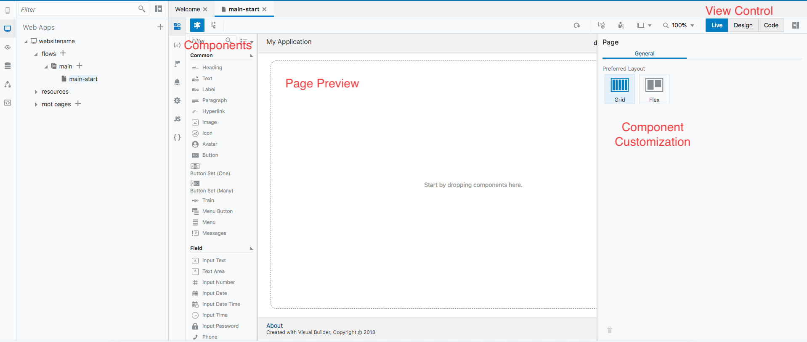<br>

Click on the `Design` view tab in the top right. Drag on an image component into the very top left corner of the page.
Click on the image component, then go to the `Data` tab on the right side of the page. For the `source url` box, enter `https://png.icons8.com/color/1600/reflector-bulb.png`. This image will act as our website's logo. As it is, the image size is bigger than what we'd expect for our logo, so let's resize it. 

<br>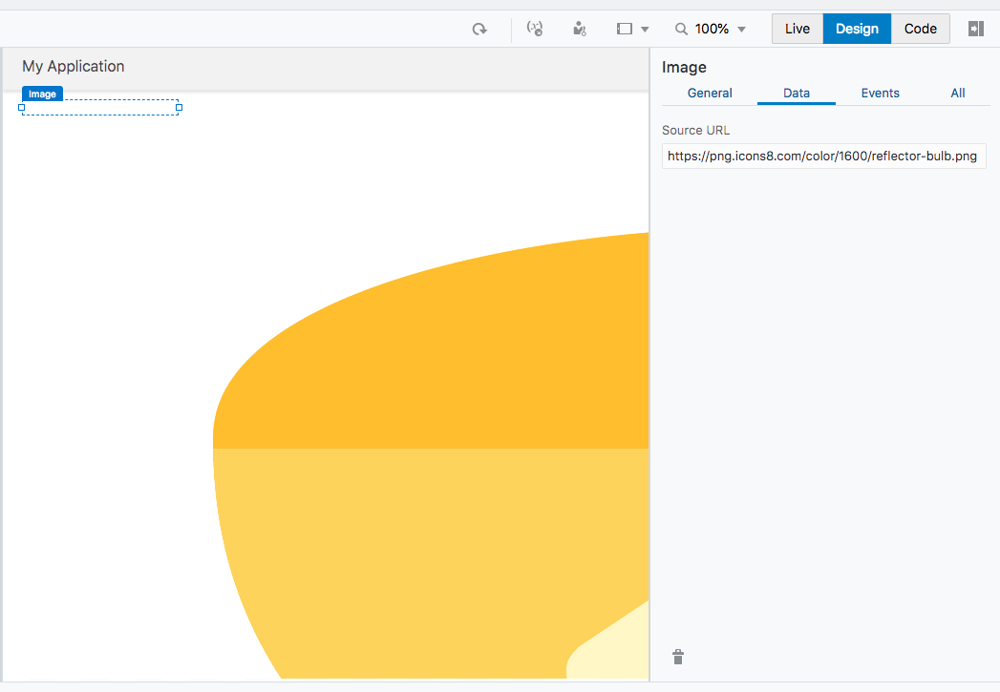<br>

Go to the `General` tab and set the `width` property to 150. Now that the image is resized, it looks much more fitting to be   our website's logo.<br>

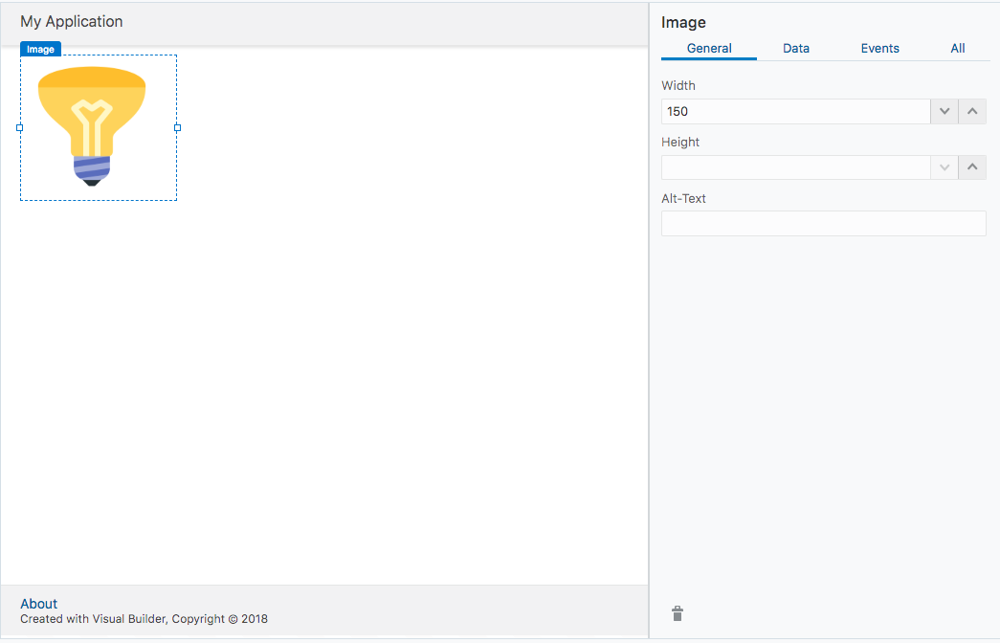<br>

Next, drag on a `Heading` component one column to the right of the logo. Under the `General` tab inside the `Text` field of the header, enter whatever name you'd like your website to be called.<br>

In the row below the logo and header, drag over a `tab bar`. The tab bar defaults to three tabs, but we only need two for now. Hover over `Tab 3` in the General tab, then hit the trash can icon. Rename the tabs `Home` and `Second Page`.<br>

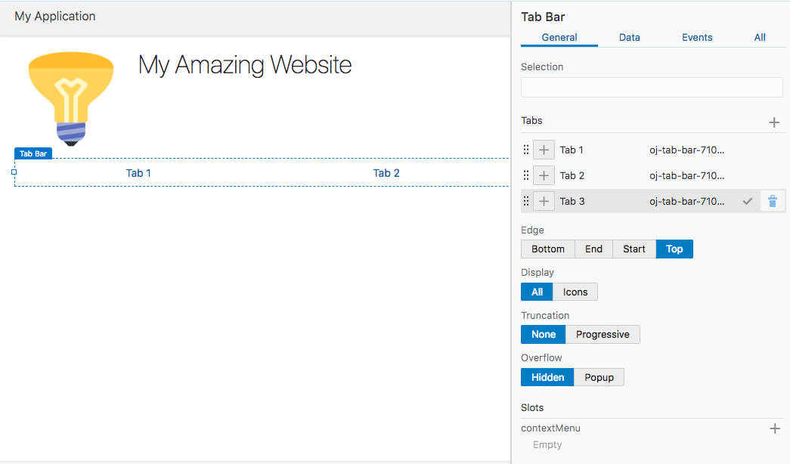<br>

The tab bar should have two tabs now; it should look like:<br>

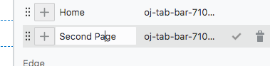<br>

Drag and drop another `Heading Component`, and fill in "Welcome to the Home page" for the text. While we're at it, let's customize the color of the text that we just entered. Click on the Heading, go to the `All` tab, then expand `General Attributes` and scroll down to the `Style` field. Enter in `color: #67aee5;`. 

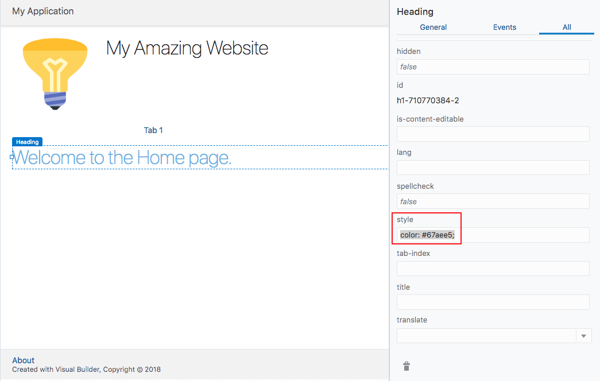<br>

The heading color changes to a light blue, as shown below. This is an easy way to customize the CSS for a specific component. <br>

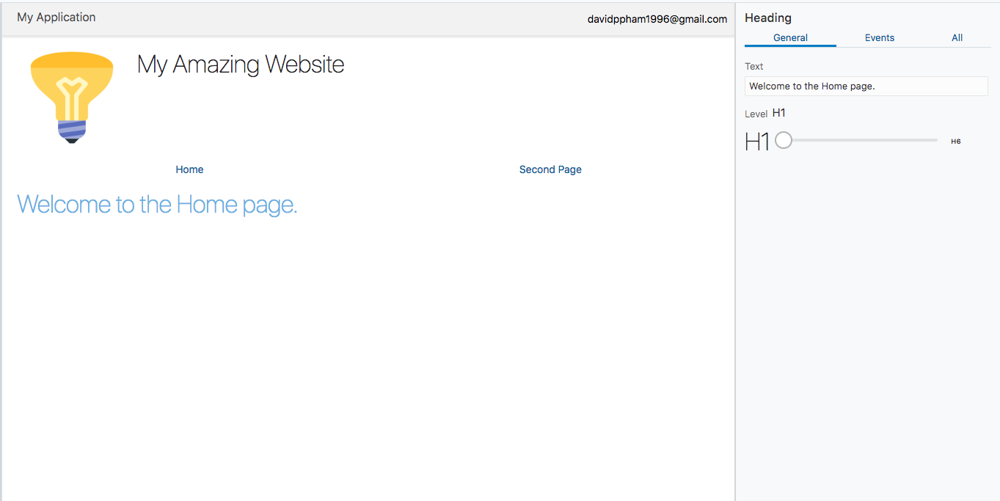<br>

In addition, we can also edit the HTML and CSS code directly. Near the top right, hit the `Code` view for the page. <br>

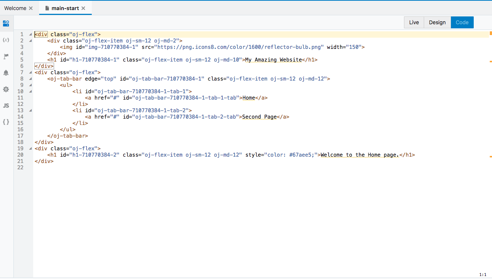<br>

To customize the tab bar, we'll first define some style. Simply paste this at the top of the Code page:

```
<style>
.bright {
background-color: #4286f4;
border-style: groove;
}
.dull {
background-color: #7790ba;
border-style: groove;
}
</style>
```

We will add this code to help style to our tabs. `.dull` shows the tab that we are currently on, and `.bright` shows the tabs we are not on.<br>

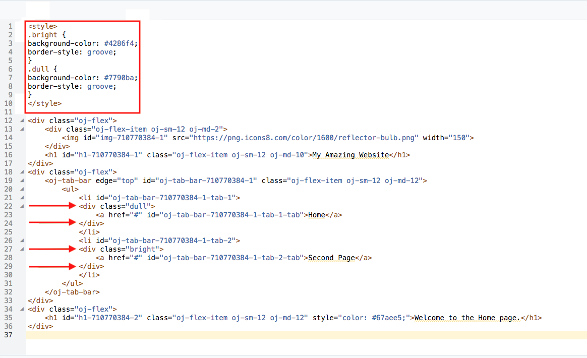<br>

Back on the design tab, we can view changes we made to the tab bar. As demonstrated, you can code HTML and CSS for your web   app the way you would for any website, while also having the option to change it in the Design view, giving you much greater flexibility.<br>

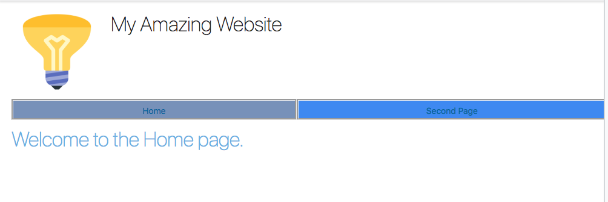<br>
  
<b>Add Navigation</b>

In order for this tab bar to actually navigate the website, we need a second page to navigate <i>to</i>. We want to carry over the components from the first page to this home page (logo, title, navbar) so we'll go ahead and copy it. Go to the Web App heirarchy on the left, right click on main-start and hit `Duplicate`. Then rename the page `second-page`. On the `Code` view, paste the code we copied.<br>

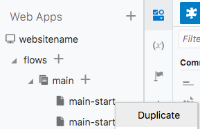<br>

Switch which tab is dull and which tab is bright in the code section of this second page. Dull tabs represent the current page we're on.<br>

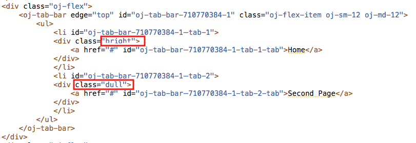<br>

On the Design view, change "Welcome to the Home Page" to say "Welcome to the Second Page". It should look like this.<br>
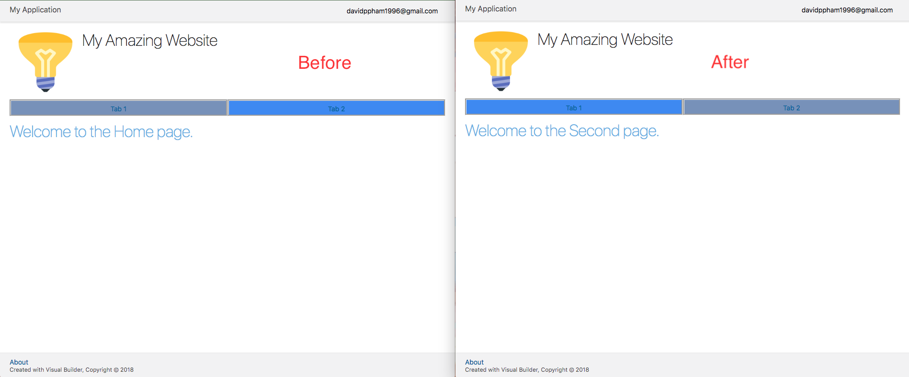<br>
<br>

Next, let's create some <i>events</i> and <i>action chains</i>. These will allow us to navigate to the second page and back 
again whenever a specific tab is clicked, rather than the text itself.<br>

Click on flow `main`, and hit the flag icon near the left to open up `Actions`. Creating an action chain at the flow level 
allows us to reuse these components on each page.<br>

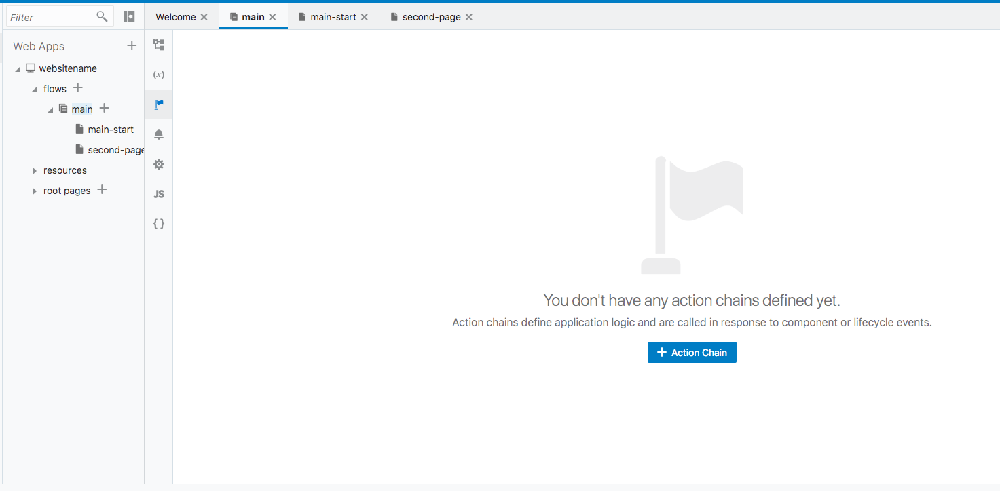<br>

Hit `+ Action Chain` to create a new action chain and call it something like `navigateHome`. <br>
Drag and drop a Navigate component to the plus sign, then click `Select Target`.<br>

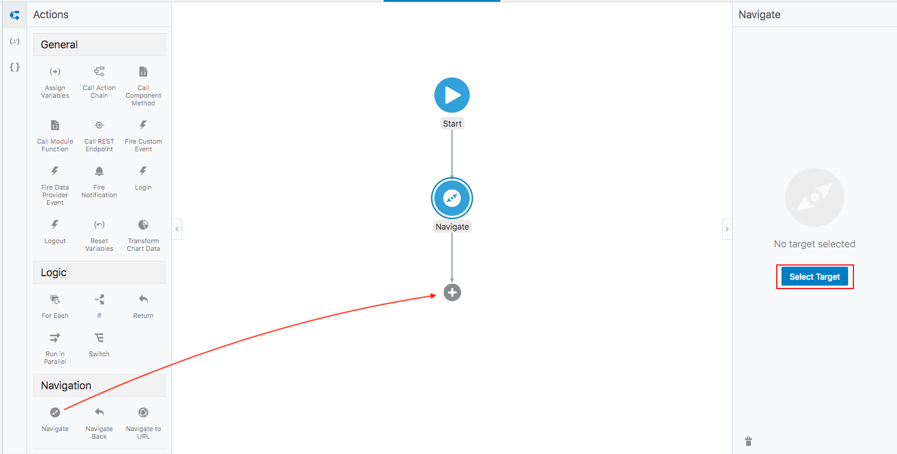<br>

Choose `Peer Page`, and then `main-start`.<br>

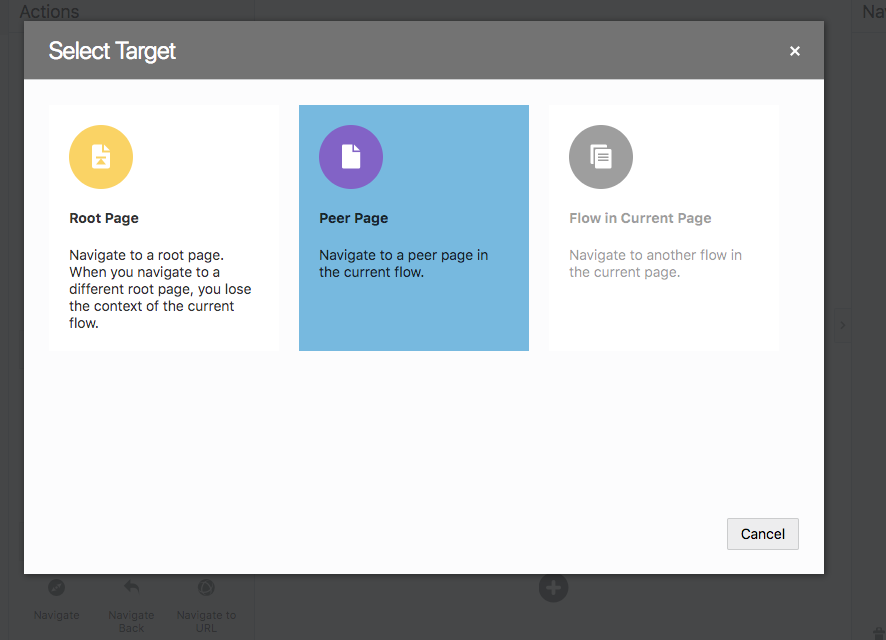<br>
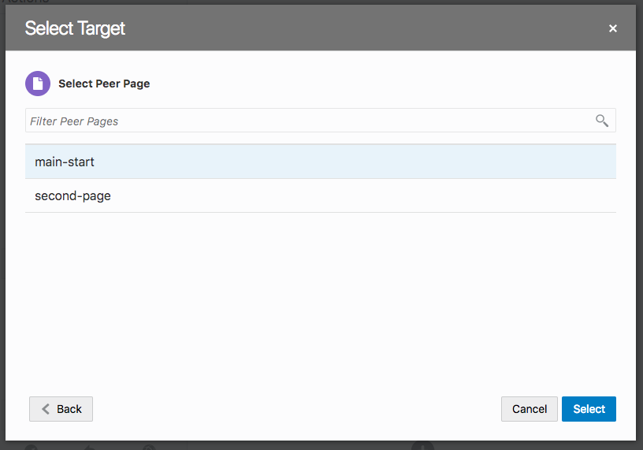<br>

Create this process for a navigateSecondPage action chain, this time selecting second-page as target.<br>

Events need to be created at the page level, because the event that triggers your action happens on a particular page. Go     back to main-start and click on the bell icon near the left to go to Events. Hit `+ Event Listener`.

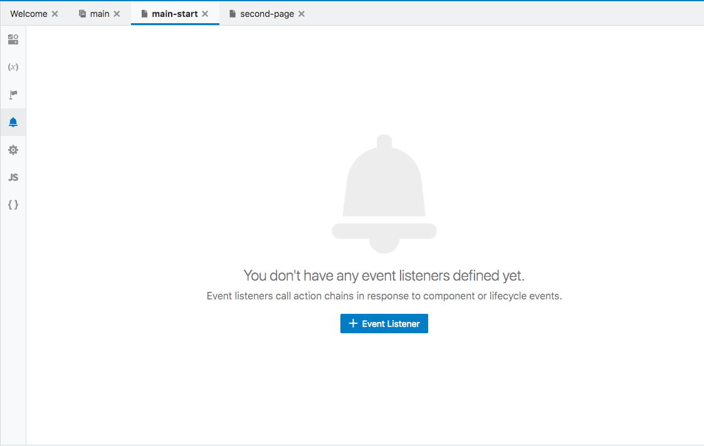<br>

Scroll down to "Other Events" and hit the plus sign. Call this something like `clickHomeTab`. When done, hit `Select`.<br>

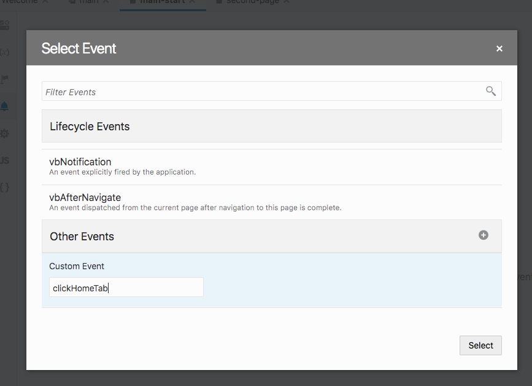<br>

On the next page, select `navigateHome` for the action chain, then hit `Select`.

<br>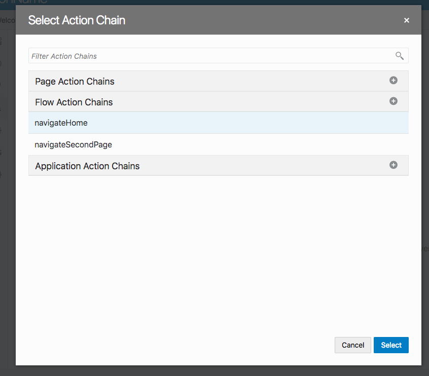<br>

Repeat this process for creating clickSecondTab and having it trigger navigateSecondPage.<br>
Then, create these same events for second-page.<br>

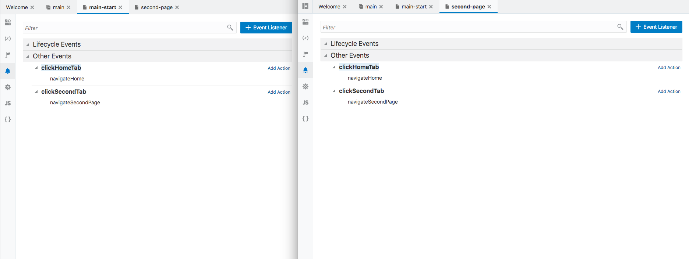<br>

Last but not least, we want to connect these event listeners to be activated whenever our tabs are clicked. Go to Code view,   and add the onclick listener after the lid for both tabs. Enter

```
<li id ="oj-tab-bar-XXXXXXXXX-X-tab-X" on-click="[[$listeners.eventName]]"
``` 

where eventName is the name of your event for each tab (i.e., clickHomeTab and clickSecondTab). <br>

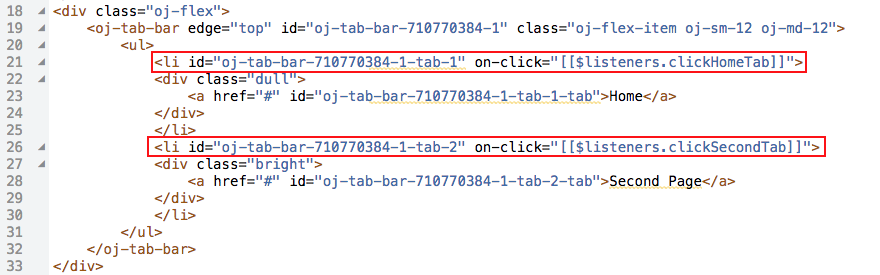<br>

<i>Note that the `Events` tab is very useful for things such as buttons where you can quickly create an action for when the button is clicked. However, in this case, because we want different parts of our tab bar to take us to different pages, we have to set them up manually.</i><br>

Finally, add the `onclick listeners` for the second page, and you should be good to go! You now have a functional website.<br>

Click on the play button in the top right to test your website, seeing that you can now navigate between the two pages.<br>

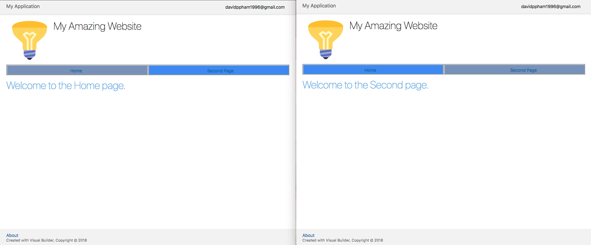
